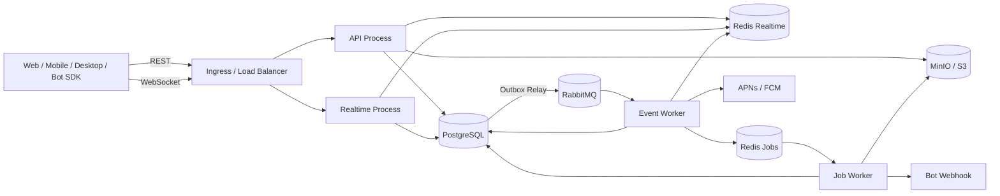
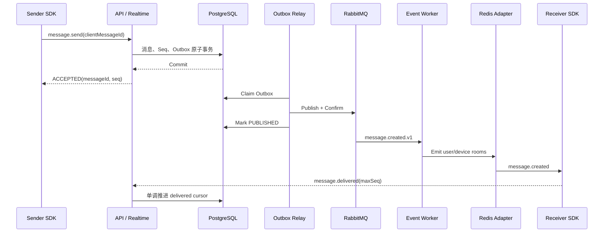

# 架构设计决策

> 状态：Accepted  
> 日期：2026-07-20  
> 决策范围：系统总体架构、运行拓扑与组件职责  
> 关联规格：[../spec.md](../spec.md)  
> 技术细节：[technical-design.md](./technical-design.md)  
> 工程规范：[standards.md](./standards.md)

## 1. 上下文

平台面向约 20,000 注册用户、3,000～5,000 峰值在线连接，需承载 500 msg/s 持续峰值和 1,000 msg/s 短时突发。主要难点是消息事务、会话顺序、客户端与消费者幂等、断线恢复、多设备一致性以及基础设施短暂故障后的自动追平，而不是服务数量或全球级扩展。

首阶段需要在有限团队和 14 周计划内完成 Web/第三方接入、消息主链路、同步、基础群聊、媒体、Bot 和治理。架构必须便于本地开发和统一演进，同时允许 API、长连接、事件消费和耗时任务独立扩缩容。

## 2. 决策

采用以下总体架构：

```text
代码层面：模块化单体 Monorepo
运行层面：API / Realtime / Event Worker / Job Worker 四进程
永久事实：PostgreSQL
可靠事件：Transactional Outbox + RabbitMQ
实时通信：Socket.IO + Redis Adapter
延迟/耗时任务：BullMQ + Redis Jobs
对象存储：MinIO / S3
离线恢复：User Sync Event + Conversation Seq
开放能力：REST + WebSocket + Contracts + SDK + Bot
```

架构采用事件驱动，但不采用 DDD 或细粒度微服务。四个进程从同一代码库组合 Feature Module 和 Platform Adapter，按负载独立部署。

## 3. 系统上下文



## 4. 进程与 Composition Module

### 4.1 API Process

负责 Auth、用户和联系人、会话与群组、消息历史、REST 消息发送兜底、Sync、上传凭证、Bot/开放平台配置、管理 API 和 OpenAPI。

```text
ApiAppModule
├── DatabaseModule
├── RealtimeRedisModule
├── ObjectStorageModule
├── OutboxModule
├── Auth/Users/Devices/Contacts Http Modules
├── Conversations/Groups/Messages Http Modules
├── Sync/Media Http Modules
└── Bots/OpenPlatform/Moderation/Admin Http Modules
```

API 不承载长连接、RabbitMQ Consumer、媒体转码或文件字节转发。

### 4.2 Realtime Process

负责 WebSocket 鉴权、连接注册、用户/设备房间、消息写命令、实时通知、Delivered/Read、Presence/Typing、心跳和 Session Revoked。

```text
RealtimeAppModule
├── DatabaseModule
├── RealtimeRedisModule
├── OutboxModule
├── RealtimeModule
├── AuthRealtimeModule
├── MessagesRealtimeModule
├── ConversationsRealtimeModule
├── PresenceRealtimeModule
└── SyncRealtimeModule
```

Realtime 的写命令与 HTTP 共用 Command Service，不在 Gateway 中实现事务或权限。

### 4.3 Event Worker

负责 Outbox Relay、RabbitMQ Consumer、Realtime Dispatch、Sync Projection、Push、Bot Event Dispatch、Moderation、Audit 和 Analytics。

```text
EventWorkerAppModule
├── DatabaseModule
├── RealtimeRedisModule
├── RabbitMqModule
├── OutboxModule
├── RealtimeDispatchModule
├── SyncEventWorkerModule
├── NotificationEventWorkerModule
├── BotEventWorkerModule
└── Moderation/Audit/Analytics Event Worker Modules
```

Consumer 按副作用归属。例如同一个 `message.created.v1` 由实时、同步、推送、Bot、审核等独立 Consumer 处理，各自拥有幂等记录。

### 4.4 Job Worker

负责媒体处理、Webhook 重试、临时文件/Session 清理、数据修复、定时消息、保留策略和周期统计。

```text
JobWorkerAppModule
├── DatabaseModule
├── JobsRedisModule
├── BullMqModule
├── ObjectStorageModule
├── MediaJobWorkerModule
├── BotWebhookJobWorkerModule
├── CleanupJobWorkerModule
└── Notification/Maintenance Job Worker Modules
```

Job Worker 不承载消息领域事件广播或客户端离线队列。

## 5. 消息主链路



PostgreSQL 事务提交是 `ACCEPTED` 的唯一边界。RabbitMQ、Redis 和 WebSocket 位于提交之后，任何一个短暂不可用只会造成通知或投影延迟，不会回滚已接受消息。详细事务与幂等机制见 [technical-design.md](./technical-design.md)。

## 6. 组件职责边界

| 组件 | 负责 | 不负责 |
| --- | --- | --- |
| PostgreSQL | 消息、会话、成员、回执游标、同步事件、Outbox 等永久事实 | Presence、Typing、文件字节 |
| RabbitMQ | 已发生的可靠业务事件、至少一次投递、消费能力解耦 | 长期离线存储、媒体转码、精确定时任务 |
| Redis Realtime | Socket.IO Adapter、Presence、连接、Typing、限流、短期撤销、热点缓存 | 永久消息事实、Sync 游标权威值 |
| Redis Jobs/BullMQ | 延迟、重试、耗时任务和进度 | 消息 Fan-out、领域事件总线、离线消息队列 |
| MinIO/S3 | 私有原始对象和衍生对象 | 附件访问授权、消息元数据 |
| WebSocket | 低延迟命令和通知 | 离线恢复、送达事实的单一依据 |
| SDK 本地库 | Pending、缓存、去重和游标副本 | 服务端永久事实 |

## 7. 故障与降级

| 故障 | 系统行为 | 恢复方式 |
| --- | --- | --- |
| PostgreSQL 不可用 | 写命令失败且不返回 `ACCEPTED`；客户端保留 Pending | 数据库恢复后复用 `clientMessageId` 重试 |
| RabbitMQ 不可用 | 消息事务可提交，Outbox 保持 Pending，异步投影延迟 | Relay 恢复后确认发布并追平 |
| Redis Realtime 不可用 | Presence/Typing 和跨节点通知降级 | PostgreSQL 事实不变，客户端 Sync 恢复 |
| Redis Jobs 不可用 | 媒体和 Webhook Job 暂停 | Redis 恢复后继续幂等执行 |
| Event Worker 不可用 | RabbitMQ Queue 积压 | Worker 恢复后按 Inbox 幂等追平 |
| Realtime 实例退出 | 部分连接断开重连 | Socket.IO 多节点 + SDK 重连 + Sync |
| MinIO/S3 不可用 | 文本消息可用，媒体上传/下载降级 | 存储恢复后继续处理，元数据不丢失 |

## 8. 替代方案

### 8.1 细粒度微服务

不采用。当前容量不需要独立数据所有权和复杂分布式事务；微服务会增加部署、协议演进、追踪和故障恢复成本。四进程已经覆盖主要负载隔离需求。

### 8.2 单进程传统单体

不采用。HTTP、长连接、事件消费和媒体任务的资源模型差异明显，需要独立扩缩容、健康检查和故障隔离。

### 8.3 数据库分库分表

不采用。目标规模可由单 PostgreSQL 集群配合正确索引和连接池承载，过早分片会显著增加会话顺序、事务和查询复杂度。

### 8.4 Redis 或 RabbitMQ 作为离线消息源

不采用。两者适合短期状态和投递，不适合作为可查询、可恢复、可备份的用户消息事实。离线恢复使用 PostgreSQL Sync Event 和 Message Seq。

### 8.5 每成员 Fan-out Write

不采用。群规模最高 2,000，逐成员消息和逐条回执会造成写放大。采用共享会话消息与用户游标。

### 8.6 跨组件 Exactly Once

不承诺。采用至少一次投递、稳定业务键、数据库唯一约束和幂等副作用，获得可验证的业务效果一致性。

### 8.7 跨地域多活与超大群

第一阶段不采用。它们需要全新的顺序、分区、冲突解决和运维模型，超出目标容量和交付范围。

## 9. 影响

正向影响：

- 一个代码库保持模块内聚，四进程允许按负载独立扩缩容。
- PostgreSQL 明确事实边界，Outbox 消除数据库与 MQ 的双写丢失窗口。
- 实时与同步分离，网络和 Redis 故障不会演变为消息丢失。
- RabbitMQ 和 BullMQ 分工明确，消费和任务均可独立重试。

代价与约束：

- 系统是最终一致的，实时通知、用户同步投影和推送允许短暂延迟。
- 所有 Consumer/Processor 必须幂等，测试必须覆盖崩溃和重投边界。
- 会话热点会竞争 `last_seq` 行锁，达到容量拐点时需监控并重新评估序号分配策略。
- 单库和单地域意味着灾难恢复依赖可靠备份、恢复演练与部署冗余。

## 10. 重新评估触发条件

若出现持续超出 1,000 msg/s、单会话 Seq 锁成为主要瓶颈、万人级实时群、单 PostgreSQL 无法满足容量、跨地域 RTO/RPO 需求或团队需要独立服务所有权，应新增编号 ADR 重新评估分区、专用消息服务或多地域架构；不得直接绕过本决策局部拆分。

