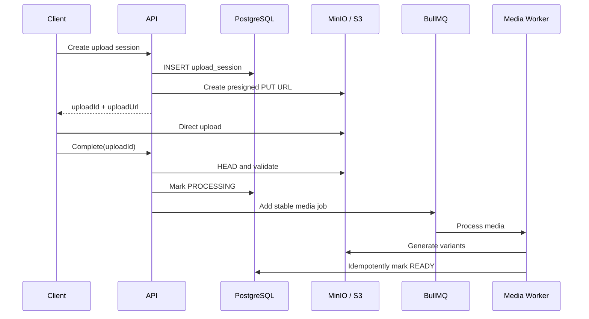

# 技术设计决策

> 状态：Accepted  
> 日期：2026-07-20  
> 决策范围：可靠消息、数据模型、同步、媒体、安全与运维机制  
> 关联规格：[../spec.md](../spec.md)  
> 总体架构：[architecture.md](./architecture.md)  
> 工程规范：[standards.md](./standards.md)

## 1. 核心一致性模型

系统采用：

```text
至少一次投递 + 幂等处理 + PostgreSQL 同步恢复
```

PostgreSQL 是事务和永久事实边界。RabbitMQ、Redis、BullMQ、Socket.IO 与客户端之间不声明跨组件 Exactly Once。业务层通过稳定幂等键、唯一约束、单调游标和可重放事件达到“不丢失、不重复副作用、顺序明确、可恢复”的结果。

### 1.1 P2 Token、Session 与联系人一致性

- Access Token 使用 RS256，15 分钟有效；API 加载私钥和公钥，Realtime 只加载公钥，Worker 不加载签名私钥。HTTP Guard 与 WebSocket Gateway 共用 Token 校验以及 PostgreSQL User/Session/Device 状态校验。
- Refresh Token 为 32 字节随机 Secret，服务端只存 HMAC-SHA256。Token Rotation 在 `auth_refresh_tokens` 行锁事务内将旧 Token 标记 `USED` 并插入后继；读取到 `USED` 即撤销 Token Family 内全部 Session。并发刷新因此采用严格重放语义，客户端必须串行刷新。
- Session/Device 撤销先提交 PostgreSQL，再通过 Redis Emitter 向 `session:{sessionId}` 发送 `session.revoked` 并断开房间。通知失败不回滚事实；后续 HTTP、刷新和 WebSocket 重连仍由 PostgreSQL 拒绝。
- Realtime 鉴权成功后加入 `user:{userId}`、`device:{deviceId}`、`session:{sessionId}`。联系人、申请和拉黑变化在 P2 仅做版本化最佳努力在线通知；持久 Outbox 与 `user_sync_events` 由 P3/P4 引入。
- Friendship 使用两条有向记录保存各自备注，接受和删除在同一事务中操作双方记录。Block 是有向唯一记录；创建 Block 的同一事务删除双方 Friendship 并取消该 Pair 的 Pending Request。
- 注销在行锁事务内把用户改为匿名墓碑、删除凭证和关系、撤销 Session/Device；举报等治理引用继续指向稳定 User UUID。

## 2. 消息身份、顺序与事务

### 2.1 标识语义

- `requestId`：一次网络命令，可在重试时变化，用于请求追踪和 ACK 关联。
- `clientMessageId`：用户意图发送的同一条消息，重试时不变，推荐 UUIDv7。
- `messageId`：服务端创建的消息标识，推荐 UUIDv7。
- `eventId`：一个领域/集成事件的稳定标识，重发时不变。
- `jobId`：一个逻辑后台任务的稳定标识，重试时不变。

数据库必须包含：

```sql
UNIQUE (sender_id, client_message_id);
UNIQUE (conversation_id, seq);
```

### 2.2 会话顺序

每个会话维护 `conversations.last_seq`。写事务使用原子更新取得下一个序号：

```sql
UPDATE conversations
SET last_seq = last_seq + 1,
    updated_at = now()
WHERE id = $1
RETURNING last_seq;
```

返回值作为新消息 `seq`。读取和同步只按 `(conversation_id, seq)` 排序；`created_at` 只用于展示和审计。

### 2.3 发送事务

Command Service 在一个 PostgreSQL 事务中依次：

1. 校验用户、Device 和 Session 状态；
2. 读取会话并校验成员、黑名单、禁言和群角色；
3. 校验消息类型、版本、Payload 和附件 `READY` 状态；
4. 按 `(sender_id, client_message_id)` 查询幂等结果，存在则返回原消息；
5. 原子增加 `conversation.last_seq`；
6. 插入 Message 并更新 Conversation Last Message；
7. 插入一个或多个版本化 Outbox Event；
8. 提交事务后返回 `messageId + seq + serverTime`。

事务内禁止 RabbitMQ Publish、Socket Emit、Push、BullMQ Add 或对象存储调用。同步事件不在消息事务中逐用户直接写入，统一由 Event Worker 投影。

## 3. Transactional Outbox

### 3.1 数据结构与状态

`outbox_events` 至少包含：

```text
id, event_id, event_type, event_version, routing_key
aggregate_type, aggregate_id, payload, headers
status, attempts, available_at, locked_by, locked_until
published_at, last_error, created_at
```

状态为 `PENDING`、`PROCESSING`、`PUBLISHED`、`FAILED`。

### 3.2 Claim 和发布

Relay 使用短事务 Claim，避免数据库锁跨越网络请求：

```sql
UPDATE outbox_events
SET status = 'PROCESSING',
    locked_by = $workerId,
    locked_until = now() + interval '30 seconds'
WHERE id IN (
  SELECT id
  FROM outbox_events
  WHERE status = 'PENDING'
     OR (status = 'PROCESSING' AND locked_until < now())
  ORDER BY created_at
  FOR UPDATE SKIP LOCKED
  LIMIT 100
)
RETURNING *;
```

事务提交后，Relay 使用 Persistent Message、`mandatory=true` 和 Publisher Confirm 发布。确认成功后标记 `PUBLISHED`；失败则增加 attempts、记录错误并按有限退避重新可用。发布成功但标记前崩溃会导致重发，这是设计允许的行为。

P3 实现参数为：250 ms 轮询、批量 100、30 秒 Claim 租约、最多 20 次发布尝试；失败使用带抖动的指数退避，500 ms 起步并封顶 60 秒。RabbitMQ 未连接时 Relay 不领取事件，因此 Broker 停机不会消耗发布尝试。

### 3.3 RabbitMQ 拓扑

Durable Exchange：

```text
im.domain.events
im.integration.events
im.retry
im.dead-letter
```

按消费能力划分 Queue：

```text
im.realtime-dispatch.q
im.sync-projection.q
im.push-notification.q
im.bot-dispatch.q
im.moderation.q
im.audit.q
im.analytics.q
```

关键 Queue 使用 Quorum Queue、合理 Prefetch、Manual ACK、Retry Queue 和 DLX/DLQ。

P3 为 Realtime Dispatch 建立 `im.realtime-dispatch.q`、5 秒/30 秒/300 秒三个 Quorum Retry Queue 和 `im.realtime-dispatch.dlq`，默认 Prefetch 为 50。临时失败在 Confirm 后进入下一级 Retry，永久错误或重试耗尽进入 DLQ；Retry/DLQ Publish 失败时关闭连接，由 RabbitMQ 重新投递未 ACK 原消息。

### 3.4 Consumer Inbox

每个会产生副作用的 Consumer：

1. 校验事件类型和版本；
2. 开启数据库事务并尝试插入 `(consumer_name, event_id)` 唯一 Inbox 记录；
3. 已存在时跳过副作用并 ACK；
4. 新事件在同一事务中完成副作用；
5. 提交事务后 ACK；
6. 临时错误进入有限 Retry，永久错误进入 DLQ；
7. 禁止无限 `nack(requeue=true)`。

不同副作用使用不同 Consumer Identity，实时分发成功不能代表同步投影、推送或 Bot 投递已经成功。

Realtime Emit 是 PostgreSQL 事务外部副作用，无法与 Inbox 原子提交。P3 对 `realtime-dispatch.v1` 使用带租约的 `PROCESSING/PROCESSED` Inbox：崩溃后可重新领取；Emit 后、标记前崩溃允许重复传输，但事件复用相同 `eventId`。这不产生重复数据库事实，客户端去重与离线恢复由 P4 完成。

## 4. 用户同步与离线恢复

### 4.1 权威生成路径

所有 `user_sync_events` 由 `im.sync-projection.q` 的 Event Worker Consumer 从 Outbox 事件幂等生成。这是唯一权威写入路径：

```text
业务事务 -> Outbox -> RabbitMQ -> Sync Projection Consumer
                         |             |
                         |             +-> user_sync_events
                         +-> 其他副作用 Consumer
```

该选择降低业务事务写放大和模块耦合，并接受短暂的最终一致延迟。Consumer Inbox 与 `(user_id, event_id)` 唯一约束共同防止重复投影。

### 4.2 数据结构

```sql
CREATE TABLE user_sync_events (
  id              bigint GENERATED ALWAYS AS IDENTITY PRIMARY KEY,
  user_id         uuid NOT NULL,
  event_id        uuid NOT NULL,
  event_type      varchar(100) NOT NULL,
  entity_type     varchar(50),
  entity_id       uuid,
  conversation_id uuid,
  payload         jsonb NOT NULL,
  created_at      timestamptz NOT NULL,
  expires_at      timestamptz,
  UNIQUE (user_id, event_id)
);

CREATE INDEX idx_sync_user_cursor
ON user_sync_events (user_id, id);
```

每个 Device 在 `device_sync_states` 中保存已确认游标。服务端按 `user_id + id` 增量返回事件，并通过会话 `lastSeq` 计算缺失 Message Range。

P4 实现细节：

- `user_sync_events.id` 是用户级单调游标，`(user_id,event_id)` 唯一约束是投影幂等最终防线；`device_sync_states` 使用 `(user_id,device_id)` 主键隔离设备进度。
- Sync Projection 使用独立 `sync-projection.v1` Consumer Inbox 和 `im.sync-projection.q` Quorum Queue。它只追加同步索引，不在投影事务中修改 Message 或 Conversation。
- 同步事件默认写入 90 天后的 `expires_at`；读取时同时执行用户过滤和保留窗口过滤。游标存在缺口时返回 `SYNC_CURSOR_EXPIRED`，不返回部分结果。
- Snapshot 使用 PostgreSQL 一致性读取组合用户、设备、联系人、黑名单、会话摘要和最新游标；客户端将快照落地后从返回游标继续增量同步。
- P4 的 SDK 在本地按 `eventId` 去重，先应用事件再提交游标；事件游标不连续时暂停顺序应用并重新执行 Sync。刷新锁保证同一 Refresh Token 不被多个请求并发消费。

### 4.3 事件与应用顺序

同步事件覆盖消息创建/更新/撤回、回执、会话创建/更新/移除、成员/群/联系人变化、设备撤销和媒体就绪。SDK 必须：

1. 刷新 Token 并建立 WebSocket；
2. 调用 Sync API 获取分页事件和缺失范围；
3. 按事件游标顺序幂等应用并补齐消息；
4. 在本地事务中提交数据和下一游标；
5. 追平后开始正常消费实时事件；
6. 实时事件按 `eventId` 去重，发现缺口再次触发 Sync。

### 4.4 游标过期

Sync Event 默认保留 90 天。过期返回 `SYNC_CURSOR_EXPIRED`，客户端依次获取用户快照、联系人、会话、群成员摘要和活跃会话最近消息，建立新游标后恢复增量同步。

## 5. Delivered、Read 与会话用户状态

`conversation_user_states` 保存：

```text
last_delivered_seq, last_read_seq, clear_before_seq
unread_count, mention_count, pinned_rank, muted
archived_at, hidden_at, updated_at
```

游标更新使用：

```sql
UPDATE conversation_user_states
SET last_read_seq = GREATEST(last_read_seq, $newSeq)
WHERE conversation_id = $conversationId
  AND user_id = $userId;
```

- `DELIVERED`：接收用户至少一个设备明确发送应用层 ACK。
- `READ`：接收用户的用户级 `last_read_seq` 已推进。
- 单聊中，对方游标覆盖消息 Seq 即可判断状态。
- 群聊默认聚合已读/未读人数，可选分页查询成员，不写每消息每成员 Receipt。
- 游标变化通过 Outbox 进入同步投影并广播到用户全部设备。

## 6. Redis 与 BullMQ

### 6.1 Redis Realtime

用于 Socket.IO Adapter、用户/设备 Presence、连接映射、Typing、限流、短期 Session 撤销和热点缓存。建议客户端每 25～30 秒心跳，Presence TTL 70～90 秒。

Key 只能由 Factory 生成：

```text
im:presence:user:{userId}
im:presence:device:{deviceId}
im:socket:user:{userId}
im:socket:device:{deviceId}
im:typing:{conversationId}:{userId}
im:rate:user:{userId}:{action}
im:cache:user:{userId}
im:cache:conversation:{conversationId}
im:session:revoked:{sessionId}
im:idempotency:{scope}:{key}
```

### 6.2 Redis Jobs 与 BullMQ

Redis Jobs 使用独立 Connection、ACL、Prefix 和监控；生产建议独立实例。BullMQ 负责媒体处理、Webhook 重试、清理、定时和维护，不负责消息 Fan-out 或领域事件。

```ts
interface JobPayload<T> {
  jobVersion: 1;
  jobId: string;
  traceId?: string;
  createdAt: string;
  data: T;
}
```

Job 使用稳定 ID、有限重试（默认 5 次）、指数退避与抖动、超时、失败告警和历史清理。Processor 必须检查目标状态并允许重复执行。

## 7. 媒体和对象存储

### 7.1 上传流程



Complete 接口必须幂等：若已进入 PROCESSING/READY，返回当前结果并复用相同 Job。附件状态为 `UPLOADING -> UPLOADED -> PROCESSING -> READY`，失败进入 `FAILED/QUARANTINED`，删除进入 `DELETED`。

### 7.2 安全边界

Bucket 私有；Object Key 由服务端生成；上传/下载 URL 短期有效；Complete 校验扩展名、MIME、Magic Bytes、大小和 Checksum；下载前检查附件与会话权限；日志不得记录完整预签名 URL；临时文件定期清理。

## 8. Bot 与 Webhook

Bot 只可访问 Scope 和会话成员关系共同允许的资源，发送消息仍经过标准权限、Seq、幂等和 Outbox 链路。

Webhook 签名：

```text
HMAC-SHA256(secret, timestamp + "\n" + nonce + "\n" + rawBody)
```

请求头为 `X-IM-App-Id`、`X-IM-Event-Id`、`X-IM-Timestamp`、`X-IM-Nonce`、`X-IM-Signature`。时间偏差不超过 5 分钟；接收方以 Event ID 幂等。2xx 成功，429/5xx 进入 BullMQ 延迟重试，普通 4xx 不重试，最终失败保留投递记录并允许人工重放。

Webhook URL 在保存和每次请求前执行 SSRF 防护，禁止本地、内网、环回、链路本地、云 Metadata 和重定向后受限地址。事件包含 Origin 和 Hop Count；Bot 默认忽略自身事件，超过 Hop 阈值停止传播。

## 9. 外部协议和 Contracts

REST、WebSocket 和 Sync 线协议以 [../spec.md §4](../spec.md#4-外部接口) 为准。所有外部协议遵循：

- API 大版本使用 `/api/v1`；列表 Cursor 分页，消息历史 Seq Cursor。
- 写接口接受幂等键和请求 ID，返回稳定机器错误码。
- WebSocket Command、Server Event、ACK 都有显式 Envelope。
- Domain/Integration Event 包含 `eventId`、`eventType`、`eventVersion`、发生时间、Trace 和版本化 Payload。
- Message Payload 由 `type + contentVersion + payload` 定义。
- Contracts 包无框架依赖；Schema 是序列化、运行时校验和代码生成的共同来源。

## 10. PostgreSQL 数据模型

| 领域 | 表 |
| --- | --- |
| 认证和用户 | users、user_credentials、devices、auth_sessions、auth_refresh_tokens、auth_challenges、auth_login_attempts、user_privacy_settings、friendships、friend_requests、blocks、reports |
| 会话和群组 | conversations、conversation_members、conversation_user_states、group_profiles、group_join_requests、group_invites |
| 消息 | messages、message_attachments、message_reactions、message_mentions、message_edits、message_user_hides |
| 媒体 | upload_sessions、attachments、media_variants |
| 同步与可靠性 | user_sync_events、device_sync_states、outbox_events、consumer_inbox_events |
| Bot 与开放平台 | api_apps、api_credentials、oauth_clients、oauth_grants、bot_accounts、bot_subscriptions、bot_webhook_endpoints、bot_webhook_deliveries |
| 治理与运维 | reports、moderation_actions、audit_logs、admin_actions、system_notices |

### 10.1 核心实体约束

`conversations` 保存类型、Direct Key、Owner、Last Seq/Message、Member Count、状态、Settings 和 Version，并建立有效单聊部分唯一索引。

`conversation_members` 保存 `(conversation_id, user_id)`、角色、状态、昵称、加入 Seq/时间、离开时间和禁言截止。

`messages` 保存 ID、Conversation、Seq、Sender/Device、Client Message ID、Type/Version/Payload、回复/转发、是否计未读、编辑/撤回和创建时间，并建立：

```sql
UNIQUE (conversation_id, seq);
UNIQUE (sender_id, client_message_id);
CREATE INDEX ON messages (conversation_id, seq DESC);
CREATE INDEX ON messages (sender_id, created_at DESC);
```

`attachments` 保存 Owner、Bucket/Object Key、原名、MIME、大小、Checksum、Kind、Status、Metadata、Ready/Expire 时间。外部响应只暴露业务 ID 和授权后生成的短期访问 URL。

## 11. 安全设计

- 密码 Argon2id；Access Token 非对称 JWT；Refresh Token/API Secret 只保存哈希。
- TLS/WSS 全链路，WebSocket 校验 Origin、Token、Session、Device 和消息大小。
- 数据库、Redis、RabbitMQ、对象存储使用最小权限；Redis ACL，RabbitMQ 独立 VHost。
- 每个写操作校验权限和资源归属；封禁/撤销同时影响 HTTP 与 WS。
- 管理后台 MFA；治理操作和管理员查看消息正文写不可篡改审计。
- Rich Card 不允许可执行 HTML；文件异步病毒扫描；Webhook 防 SSRF。
- 日志和 Trace 不包含密码、Token、Secret、完整私聊正文或完整预签名 URL。

## 12. 可观测性和告警

结构化日志关联字段：

```text
requestId traceId userId deviceId conversationId messageId
eventId jobId queue latencyMs errorCode
```

核心指标：

```text
im_http_request_duration          im_ws_connections
im_ws_connection_failures        im_message_accept_duration
im_message_delivery_duration     im_message_duplicate_total
im_sync_lag                      im_outbox_pending
im_outbox_oldest_age             im_rabbitmq_queue_depth
im_rabbitmq_redelivery_total     im_rabbitmq_dlq_total
im_bullmq_failed_jobs            im_bot_webhook_failures
im_media_processing_duration     im_postgres_lock_wait
im_postgres_pool_usage           im_redis_memory_usage
```

MVP 关键告警至少覆盖：Outbox 最老事件 > 30 秒、Queue 持续增长、DLQ 出现、Sync Lag 超阈值、PostgreSQL Pool > 80%、Redis Memory > 80%、消息接受 P95 > 500 ms、WebSocket 断线率、Bot/媒体失败率异常。

高级 Dashboard 与全面 Trace 可后置，但日志关联、指标采集和关键告警不能后置。

## 13. 备份、恢复与容量

- PostgreSQL 启用自动备份并定义 RPO/RTO；MVP 上线前至少完成一次恢复验证。
- RabbitMQ、Redis 和对象存储配置应可重建；永久业务恢复以 PostgreSQL 和对象存储备份为核心。
- Sync Event 默认保留 90 天，清理任务不得删除仍在保留窗口内的数据。
- 监控 PostgreSQL 行锁、连接池、消息表增长、会话热点、Outbox Lag、Queue Depth、Redis 内存和对象存储容量。
- 容量验证按 5,000 长连接、500 msg/s 持续、1,000 msg/s 突发、500 人群、1,000 同时重连等场景执行。

## 14. 关键故障测试

实现必须覆盖以下崩溃边界：

- API 提交消息后、返回 ACK 前退出；
- Outbox Publish 成功后、标记 PUBLISHED 前退出；
- Consumer 事务提交后、RabbitMQ ACK 前退出；
- BullMQ Processor 产生文件后、标记 READY 前退出；
- 上传完成但 Complete 响应丢失；
- 客户端收到消息但 Delivered ACK 丢失；
- 多设备并发推进 Read Cursor；
- Redis/RabbitMQ/Worker 暂停后恢复追平。

每个场景的成功条件都是：PostgreSQL 事实不丢失、唯一约束保持、重复执行无重复副作用，并可由同步链路得到一致客户端状态。
