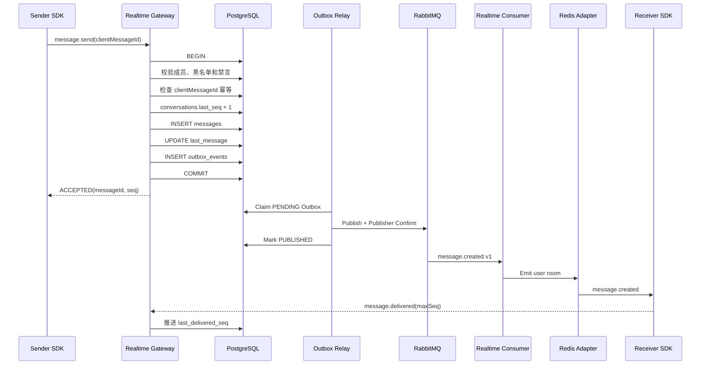
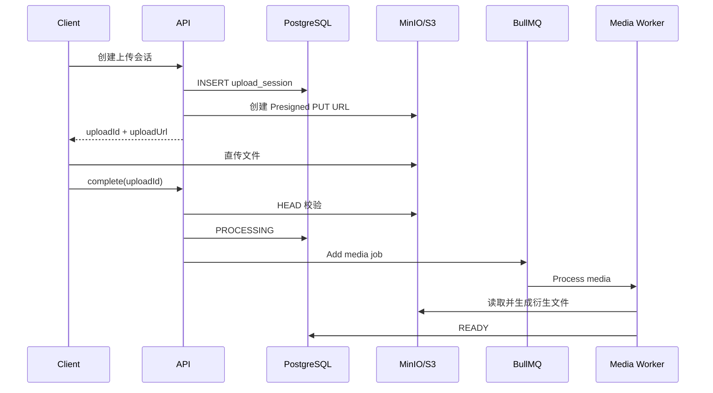
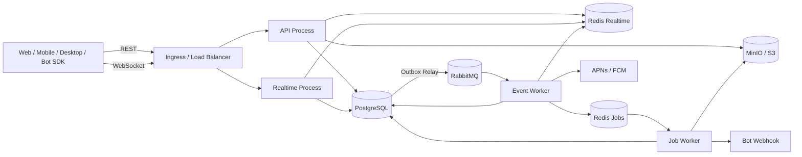

# 中型 IM 平台完整 PRD、架构设计、实施计划与代码规范

> 技术栈：NestJS + TypeScript + PostgreSQL + TypeORM + Redis + RabbitMQ + BullMQ + MinIO/S3 + Socket.IO
> 目标规模：约 20,000 注册用户，3,000～5,000 峰值在线连接
> 性能基线：500 msg/s 持续峰值，1,000 msg/s 短时突发
> 架构风格：模块化单体代码库、多进程独立部署、事件驱动、非 DDD
> 文档版本：v2.0
> 日期：2026-07-20

---

# 1. 项目概述

## 1.1 产品定位

建设一套支持 Web、桌面端、移动端和第三方应用接入的完整 IM 平台，提供：

- 用户认证与多设备登录；

- 联系人与黑名单；

- 单聊、群聊、系统会话；

- 文本、图片、语音、视频、文件等多模态消息；

- 消息发送、送达、已读、撤回、编辑、回复、引用和表情回应；

- 离线消息与断线恢复；

- 多设备状态同步；

- REST API、WebSocket 协议和客户端 SDK；

- Bot、Webhook 与开放平台；

- 基础管理后台、审计和内容治理；

- 完整的监控、告警、备份和故障恢复能力。

## 1.2 架构目标

系统首先保证：

1. 消息不因网络断开而丢失；

2. 客户端重试不会产生重复消息；

3. 消息在同一会话中拥有确定顺序；

4. RabbitMQ 重复投递不会产生重复副作用；

5. WebSocket 通知丢失后可以通过同步接口恢复；

6. 多个设备最终看到一致的会话、消息和已读状态；

7. Redis、RabbitMQ 或 Worker 短暂故障不会破坏消息事实；

8. API、WebSocket、事件协议和 SDK 可以稳定版本化。

## 1.3 非目标

第一阶段不实现：

- 百万长连接；

- 万人级实时聊天室；

- 跨地域多活；

- 数据库分库分表；

- 端到端加密；

- 音视频实时通话；

- 完整企业组织架构；

- 推荐流、朋友圈、频道；

- 独立 Elasticsearch 集群；

- 十几个细粒度微服务。

---

# 2. 容量与性能目标

| 指标             |            目标 |
| ---------------- | --------------: |
| 注册用户         |          20,000 |
| 日活用户         |    3,000～8,000 |
| 峰值在线连接     |    3,000～5,000 |
| 普通消息持续峰值 |       500 msg/s |
| 短时突发         |     1,000 msg/s |
| 单群默认成员上限 |             500 |
| 单群可配置上限   |           2,000 |
| 单用户设备数     | 默认 5，最大 10 |
| 消息接受 ACK P95 |      小于 200ms |
| 在线消息投递 P95 |      小于 500ms |
| REST API P95     |      小于 300ms |
| 服务可用性       |           99.9% |
| Sync Event 保留  |           90 天 |
| Access Token     |         15 分钟 |
| Refresh Token    |           30 天 |

---

# 3. 用户角色

| 角色         | 核心权限                                       |
| ------------ | ---------------------------------------------- |
| 普通用户     | 登录、联系人、单聊、群聊、多模态消息、设备管理 |
| 群主         | 群资料、成员、管理员、禁言、转让和解散         |
| 群管理员     | 成员审批、邀请、移除、禁言和公告               |
| Bot          | 在授权会话中接收事件和发送消息                 |
| 开放平台应用 | 使用 API Key 或 OAuth 访问授权 API             |
| 平台管理员   | 用户治理、群治理、Bot 管理、审计和系统配置     |

---

# 4. PRD：认证与账号系统

## 4.1 功能范围

- 邮箱注册；

- 手机号注册；

- 密码登录；

- 邮箱或短信验证码登录预留；

- Access Token；

- Refresh Token；

- Refresh Token Rotation；

- 多设备登录；

- 查看登录设备；

- 移除指定设备；

- 单设备登出；

- 全设备登出；

- 修改密码；

- 找回密码；

- 冻结、封禁和注销；

- 登录失败限流；

- 可疑登录提醒；

- MFA 预留。

## 4.2 Token 设计

### Access Token

- 使用 JWT；

- 有效期 15 分钟；

- 包含 `userId`、`sessionId`、`deviceId`；

- 使用非对称签名；

- 不保存敏感业务信息；

- WebSocket 握手时使用。

### Refresh Token

- 使用高熵随机字符串；

- 服务端只保存哈希；

- 与 Session、Device 和 Token Family 绑定；

- 每次刷新都生成新的 Refresh Token；

- 旧 Token 标记为已使用；

- 发现旧 Token 重放时，撤销整个 Token Family。

## 4.3 认证状态

```text
ACTIVE
FROZEN
DISABLED
DELETED
```

## 4.4 验收标准

- 被移除设备不能继续刷新 Token；

- 管理员封禁后，HTTP 和 WebSocket 均失效；

- Refresh Token 重放会撤销 Token Family；

- Access Token 过期后 SDK 自动刷新并重新同步；

- 密码修改可选择撤销其他设备 Session。

---

# 5. PRD：用户、隐私与联系人

## 5.1 用户资料

- 用户名；

- 昵称；

- 头像；

- 个性签名；

- 地区；

- 用户状态；

- 最后在线时间；

- 用户类型：`USER`、`BOT`、`SYSTEM`；

- 自定义扩展字段。

## 5.2 隐私设置

- 谁可以搜索我；

- 谁可以加我；

- 谁可以邀请我入群；

- 是否允许陌生人发消息；

- 是否展示在线状态；

- 是否展示最后在线时间；

- 是否允许 Bot 发起私聊。

## 5.3 联系人能力

- 发起好友申请；

- 接受或拒绝申请；

- 删除联系人；

- 联系人备注；

- 黑名单；

- 举报用户；

- 联系人列表；

- 联系人变化多端同步。

## 5.4 黑名单规则

- 被拉黑者不能发起新的单聊；

- 已有单聊中的消息发送被拒绝；

- 私聊黑名单不影响共同群聊；

- 被拉黑者不能获取对方精确在线状态；

- Bot 同样遵循黑名单和权限规则。

---

# 6. PRD：会话管理

## 6.1 会话类型

```text
DIRECT
GROUP
SYSTEM
BOT
```

Bot 也可以作为特殊用户参与 `DIRECT` 或 `GROUP`，`BOT` 类型不是必需。

## 6.2 会话能力

- 创建单聊；

- 创建群聊；

- 会话列表；

- 会话详情；

- 最后一条消息；

- 未读数；

- @未读数；

- 置顶；

- 免打扰；

- 归档；

- 隐藏本地会话；

- 清空本地历史；

- 云端草稿预留；

- 会话背景等客户端设置；

- 新消息到达后恢复已隐藏会话。

## 6.3 单聊唯一性

任意两个普通用户只存在一个有效单聊。

```text
direct_key = min(userAId, userBId) + ":" + max(userAId, userBId)
```

数据库建立部分唯一索引：

```sql
CREATE UNIQUE INDEX uk_direct_conversation
ON conversations (direct_key)
WHERE type = 'DIRECT' AND status = 'ACTIVE';
```

---

# 7. PRD：群聊

## 7.1 群成员角色

```text
OWNER
ADMIN
MEMBER
```

## 7.2 群能力

- 创建群；

- 修改群名称、头像和简介；

- 群公告；

- 邀请成员；

- 用户申请入群；

- 审批入群；

- 邀请链接预留；

- 主动退群；

- 移除成员；

- 设置管理员；

- 取消管理员；

- 转让群主；

- 解散群；

- 全员禁言；

- 单成员禁言；

- 群成员昵称；

- @成员；

- @所有人；

- 群成员列表分页；

- 成员变更同步；

- 群消息撤回权限；

- 群资料变更系统消息。

## 7.3 群系统消息

```text
SYSTEM_MEMBER_JOINED
SYSTEM_MEMBER_LEFT
SYSTEM_MEMBER_REMOVED
SYSTEM_GROUP_UPDATED
SYSTEM_OWNER_TRANSFERRED
SYSTEM_ADMIN_CHANGED
SYSTEM_MUTE_CHANGED
```

系统消息与普通消息使用同一会话序号，但通过以下字段控制展示：

```text
countsUnread
isVisible
templateKey
templateParams
```

## 7.4 群规模策略

- 默认上限 500 人；

- 可配置提升到 2,000 人；

- 大于 200 人时，群已读默认只显示人数；

- 不为每条群消息生成每成员一条回执；

- 不做每成员 Fan-out Write。

---

# 8. PRD：消息系统

## 8.1 消息类型

```text
TEXT
IMAGE
AUDIO
VIDEO
FILE
LOCATION
CONTACT
RICH_CARD
CUSTOM
SYSTEM
```

## 8.2 消息通用结构

```json
{
  "id": "uuid-v7",
  "conversationId": "uuid-v7",
  "seq": 1024,
  "senderId": "uuid-v7",
  "senderDeviceId": "uuid-v7",
  "clientMessageId": "uuid-v7",
  "type": "IMAGE",
  "contentVersion": 1,
  "payload": {},
  "replyToMessageId": null,
  "createdAt": "2026-07-20T10:00:00.000Z"
}
```

## 8.3 消息版本

每种消息必须包含：

```text
type
contentVersion
payload
```

协议不兼容变更必须提升 `contentVersion`，不能直接修改旧协议字段语义。

## 8.4 消息操作

- 发送；

- 失败重试；

- 回复；

- 引用；

- 转发；

- 编辑；

- 撤回；

- 删除自己本地视图；

- 清空自己历史；

- 表情回应；

- @成员；

- 举报；

- 消息搜索；

- 消息收藏预留；

- 定时消息预留。

## 8.5 消息状态

### 客户端本地状态

```text
LOCAL_PENDING
UPLOADING
SENDING
ACCEPTED
FAILED
RECALLED
```

### 服务端回执状态

```text
ACCEPTED
DELIVERED
READ
RECALLED
DELETED_FOR_USER
```

### 状态语义

- `ACCEPTED`：消息已提交 PostgreSQL；

- `DELIVERED`：接收用户至少一个设备发送应用层 ACK；

- `READ`：接收用户已读游标推进到该消息之后；

- WebSocket Emit 成功不等于 Delivered；

- APNs/FCM 推送成功不等于 Delivered。

## 8.6 消息限制

| 内容                  | 默认限制 |
| --------------------- | -------: |
| 文本消息              |      8KB |
| Custom Payload        |     32KB |
| 图片                  |     20MB |
| 语音                  |     20MB |
| 视频                  |    500MB |
| 普通文件              |      1GB |
| 单条 Rich Card Action |    10 个 |

---

# 9. 消息可靠性设计

## 9.1 核心原则

系统采用：

```text
至少一次投递 + 幂等处理 + 数据库同步恢复
```

不宣称跨 PostgreSQL、RabbitMQ、Redis、WebSocket 和客户端实现严格 Exactly Once。

## 9.2 消息顺序

不能使用 `created_at` 作为消息唯一顺序。

每个会话维护：

```text
conversations.last_seq
```

发送时：

```sql
UPDATE conversations
SET last_seq = last_seq + 1,
    updated_at = now()
WHERE id = $1
RETURNING last_seq;
```

返回值作为消息 `seq`。

消息顺序由：

```text
conversation_id + seq
```

唯一确定。

## 9.3 客户端幂等

客户端发送消息时生成：

```text
clientMessageId
```

推荐 UUIDv7。

数据库约束：

```sql
UNIQUE (sender_id, client_message_id)
UNIQUE (conversation_id, seq)
```

超时重试必须复用相同 `clientMessageId`。

## 9.4 Request ID 与 Client Message ID

```text
requestId：
标识一次网络命令，重试时可以变化。

clientMessageId：
标识用户想发送的那一条消息，重试时必须保持不变。
```

---

# 10. 消息发送完整链路



## 10.1 消息发送事务

事务内执行：

1. 校验发送用户状态；

2. 校验设备和 Session；

3. 查询会话；

4. 校验发送者成员关系；

5. 校验拉黑、禁言和群角色；

6. 校验消息类型和 Payload；

7. 校验附件是否 `READY`；

8. 查询 `clientMessageId` 幂等；

9. 原子增加 `conversation.last_seq`；

10. 插入消息；

11. 更新会话最后消息；

12. 写入用户同步事件或变更标识；

13. 写入 Outbox；

14. 提交事务；

15. 返回 `messageId + seq + serverTime`。

禁止在事务中直接 Publish RabbitMQ。

---

# 11. Transactional Outbox

## 11.1 Outbox 表

```text
id
event_id
event_type
event_version
routing_key
aggregate_type
aggregate_id
payload
headers
status
attempts
available_at
locked_by
locked_until
published_at
last_error
created_at
```

状态：

```text
PENDING
PROCESSING
PUBLISHED
FAILED
```

## 11.2 两阶段领取

### 短事务 Claim

```sql
UPDATE outbox_events
SET status = 'PROCESSING',
    locked_by = $workerId,
    locked_until = now() + interval '30 seconds'
WHERE id IN (
  SELECT id
  FROM outbox_events
  WHERE status = 'PENDING'
     OR (
       status = 'PROCESSING'
       AND locked_until < now()
     )
  ORDER BY created_at
  FOR UPDATE SKIP LOCKED
  LIMIT 100
)
RETURNING *;
```

立即提交数据库事务。

### 事务外发布

```text
Publish RabbitMQ
→ 等待 Publisher Confirm
→ 标记 PUBLISHED
```

如果发布成功后 Worker 崩溃，事件可能再次发布，因此消费者必须幂等。

---

# 12. RabbitMQ 设计

## 12.1 职责

RabbitMQ 负责已经发生的可靠业务事件：

```text
message.created.v1
message.edited.v1
message.recalled.v1
message.reaction-changed.v1
conversation.created.v1
conversation.member-added.v1
conversation.member-removed.v1
conversation.settings-changed.v1
media.ready.v1
session.revoked.v1
```

RabbitMQ 不负责：

- 用户长期离线消息存储；

- 图片和视频转码；

- 精确定时任务；

- 客户端消息历史查询；

- 每个用户一条离线队列。

## 12.2 Exchange

```text
im.domain.events
im.integration.events
im.retry
im.dead-letter
```

全部使用 Durable Exchange。

## 12.3 Queue

```text
im.realtime-dispatch.q
im.sync-projection.q
im.push-notification.q
im.bot-dispatch.q
im.moderation.q
im.audit.q
im.analytics.q
```

Queue 按消费能力划分，而不是按事件来源划分。

## 12.4 可靠性配置

- Durable Queue；

- 关键队列使用 Quorum Queue；

- Persistent Message；

- Publisher Confirm；

- `mandatory=true`；

- Consumer Manual ACK；

- 合理 Prefetch；

- Retry Queue；

- Dead Letter Exchange；

- Consumer Inbox 幂等；

- DLQ 告警。

## 12.5 Consumer 处理规则

1. 校验事件类型和版本；

2. 检查 `eventId` 是否已处理；

3. 开启数据库事务；

4. 插入 `consumer_inbox_events`；

5. 执行业务副作用；

6. 提交事务；

7. 最后 ACK；

8. 临时错误进入 Retry；

9. 永久错误进入 DLQ；

10. 禁止无限 `nack(requeue=true)`。

---

# 13. BullMQ 设计

## 13.1 职责

BullMQ 负责未来执行或耗时任务：

```text
image-thumbnail
video-cover
video-transcode
audio-metadata
file-virus-scan
bot-webhook-retry
cleanup-upload
cleanup-session
scheduled-message
retention-cleanup
statistics-daily
data-repair
```

## 13.2 不允许使用 BullMQ 的场景

```text
message-fanout
message.created 领域事件
conversation.updated 广播
客户端离线消息队列
```

## 13.3 Job 规范

```ts
interface JobPayload<T> {
  jobVersion: 1;
  jobId: string;
  traceId?: string;
  createdAt: string;
  data: T;
}
```

要求：

- 明确 Job ID；

- Job Processor 可重复执行；

- 默认 5 次重试；

- 指数退避；

- 添加随机抖动；

- 设置超时；

- 失败告警；

- 定期清理历史 Job。

---

# 14. Redis 设计

## 14.1 两套 Redis 逻辑连接

### Redis Realtime

用于：

- Socket.IO 多节点适配；

- 在线状态；

- 设备连接；

- 输入状态；

- 限流；

- 短期 Session 撤销；

- 热点缓存。

### Redis Jobs

用于：

- BullMQ；

- Delayed Job；

- Retry；

- Job Progress；

- Job Event。

开发环境可以共用 Redis 服务，但使用不同：

- ACL；

- Prefix；

- Connection；

- 监控指标。

生产环境建议使用独立实例。

## 14.2 Key 规范

```text
im:presence:user:{userId}
im:presence:device:{deviceId}
im:socket:user:{userId}
im:socket:device:{deviceId}
im:typing:{conversationId}:{userId}
im:rate:user:{userId}:{action}
im:cache:user:{userId}
im:cache:conversation:{conversationId}
im:session:revoked:{sessionId}
im:idempotency:{scope}:{key}
```

所有 Redis Key 必须由统一 Factory 创建，业务代码禁止手写 Key 字符串。

## 14.3 Presence

```text
ONLINE：至少一个设备心跳有效
AWAY：存在连接但长时间无活跃
OFFLINE：没有有效设备
```

建议：

- 客户端每 25～30 秒心跳；

- Presence TTL 70～90 秒；

- 异常断开由 TTL 自动清理。

---

# 15. 离线消息与多端同步

## 15.1 核心原则

WebSocket 只负责低延迟通知。

离线恢复依赖：

```text
PostgreSQL User Sync Event + Conversation Message Seq
```

## 15.2 用户同步事件

```sql
CREATE TABLE user_sync_events (
  id              bigint GENERATED ALWAYS AS IDENTITY PRIMARY KEY,
  user_id         uuid NOT NULL,
  event_id        uuid NOT NULL,
  event_type      varchar(100) NOT NULL,
  entity_type     varchar(50),
  entity_id       uuid,
  conversation_id uuid,
  payload         jsonb NOT NULL,
  created_at      timestamptz NOT NULL,
  expires_at      timestamptz,
  UNIQUE (user_id, event_id)
);

CREATE INDEX idx_sync_user_cursor
ON user_sync_events (user_id, id);
```

客户端保存：

```text
lastSyncEventId
```

查询：

```sql
SELECT *
FROM user_sync_events
WHERE user_id = $1
  AND id > $2
ORDER BY id
LIMIT $3;
```

## 15.3 同步事件类型

```text
message.created
message.updated
message.recalled
receipt.updated
conversation.created
conversation.updated
conversation.removed
conversation.member-changed
group.updated
contact.updated
device.revoked
media.ready
```

## 15.4 多端同步规则

- 消息发送后同步到发送者其他设备；

- 任意设备已读后推进用户级已读游标；

- 已读状态同步到用户全部在线设备；

- 每个设备拥有独立 Sync Cursor；

- 会话已读状态属于用户，不属于单个设备；

- 本地 UI 设置和本地草稿可以保持设备级；

- 置顶、免打扰和归档默认用户级同步。

## 15.5 Sync API

```http
POST /api/v1/sync
```

请求：

```json
{
  "deviceId": "uuid-v7",
  "userSyncCursor": 1024,
  "conversationCursors": [
    {
      "conversationId": "uuid-v7",
      "lastSeq": 88
    }
  ],
  "limit": 500
}
```

响应：

```json
{
  "nextUserSyncCursor": 1097,
  "hasMore": false,
  "events": [],
  "messageRanges": [
    {
      "conversationId": "uuid-v7",
      "fromSeq": 89,
      "toSeq": 96
    }
  ],
  "serverTime": 1784520000000
}
```

## 15.6 Cursor 过期

Sync Event 默认保留 90 天。

游标过期返回：

```json
{
  "code": "SYNC_CURSOR_EXPIRED",
  "fullSyncRequired": true
}
```

客户端执行：

1. 拉取用户快照；

2. 拉取联系人；

3. 拉取会话列表；

4. 拉取群成员摘要；

5. 补齐活跃会话最近消息；

6. 建立新的 Sync Cursor；

7. 继续增量同步。

---

# 16. 消息送达和已读

## 16.1 使用游标而非逐消息回执

```text
conversation_user_states.last_delivered_seq
conversation_user_states.last_read_seq
```

更新时：

```sql
UPDATE conversation_user_states
SET last_read_seq = GREATEST(last_read_seq, $newSeq)
WHERE conversation_id = $conversationId
  AND user_id = $userId;
```

游标只能前进。

## 16.2 单聊状态判断

对于消息 `seq = 100`：

```text
对方 last_delivered_seq >= 100 → DELIVERED
对方 last_read_seq >= 100      → READ
```

## 16.3 群聊状态

群聊默认展示：

- 已读人数；

- 未读人数；

- 可选已读成员分页。

不为每条群消息写入 N 条永久 Receipt。

---

# 17. 多模态和对象存储

## 17.1 上传链路



## 17.2 附件状态

```text
UPLOADING
UPLOADED
PROCESSING
READY
FAILED
QUARANTINED
DELETED
```

## 17.3 安全要求

- Bucket 默认私有；

- 客户端不能自定义 Object Key；

- 上传 URL 短时有效；

- 下载 URL 短时有效；

- 校验扩展名、MIME 和 Magic Bytes；

- 校验大小和 Checksum；

- 支持病毒扫描；

- 未完成上传自动清理；

- 下载前检查会话和附件访问权限；

- 日志不记录完整预签名 URL；

- 业务层只依赖 S3 兼容接口。

---

# 18. Bot 与开放平台

## 18.1 Bot 类型

1. Webhook Bot；

2. API Bot；

3. 内部 Bot；

4. Command Bot。

## 18.2 Bot 能力

- Bot 账号；

- Bot 头像和资料；

- 加入群聊；

- 与用户单聊；

- 订阅消息事件；

- 发送文本、图片、文件和卡片；

- 响应 Slash Command；

- 响应卡片按钮；

- Token 轮换；

- 事件重放；

- 调试投递记录；

- Scope 权限控制。

## 18.3 Scope

```text
users:read
conversations:read
conversations:write
members:read
messages:read
messages:write
media:write
webhooks:manage
```

## 18.4 Webhook 请求头

```text
X-IM-App-Id
X-IM-Event-Id
X-IM-Timestamp
X-IM-Nonce
X-IM-Signature
```

签名：

```text
HMAC-SHA256(
  secret,
  timestamp + "\n" + nonce + "\n" + rawBody
)
```

## 18.5 Webhook 规则

- 时间偏差不超过 5 分钟；

- `eventId` 幂等；

- 2xx 为成功；

- 429 和 5xx 重试；

- 4xx 默认不重试；

- BullMQ 负责延迟重试；

- 最大次数后进入失败记录；

- 支持后台手动重放；

- URL 必须进行 SSRF 防护；

- 禁止访问本地、内网和云 Metadata 地址。

## 18.6 Bot 防循环

事件包含：

```json
{
  "origin": {
    "type": "USER",
    "id": "uuid"
  },
  "hopCount": 1
}
```

规则：

- Bot 默认不消费自己产生的事件；

- `hopCount` 超过阈值后停止；

- 避免多个 Bot 相互自动回复；

- Bot 发消息同样经过消息幂等和权限校验。

---

# 19. REST API

统一前缀：

```text
/api/v1
```

列表接口统一 Cursor 分页：

```
cursor
limit
nextCursor
hasMore
```

写接口支持：

```
Idempotency-Key
X-Request-Id
```

稳定错误结构：

```
{
  "requestId": "req_...",
  "code": "MESSAGE_FORBIDDEN",
  "message": "The message cannot be sent",
  "details": {},
  "timestamp": 1784520000000
}
```

## 19.1 Auth

```text
POST   /auth/register
POST   /auth/login
POST   /auth/refresh
POST   /auth/logout
POST   /auth/logout-all
GET    /auth/sessions
DELETE /auth/sessions/:sessionId
```

## 19.2 用户与设备

```text
GET    /users/me
PATCH  /users/me
GET    /users/:userId
GET    /users/search
GET    /devices
DELETE /devices/:deviceId
GET    /privacy-settings
PATCH  /privacy-settings
```

## 19.3 联系人

```text
POST   /friend-requests
GET    /friend-requests
POST   /friend-requests/:id/accept
POST   /friend-requests/:id/reject
GET    /contacts
DELETE /contacts/:userId
POST   /blocks/:userId
DELETE /blocks/:userId
GET    /blocks
```

## 19.4 会话与群聊

```text
POST   /conversations/direct
POST   /conversations/groups
GET    /conversations
GET    /conversations/:id
PATCH  /conversations/:id/settings
DELETE /conversations/:id/view
POST   /conversations/:id/read
GET    /conversations/:id/members
POST   /conversations/:id/members
DELETE /conversations/:id/members/:userId
POST   /conversations/:id/leave
POST   /conversations/:id/transfer-owner
DELETE /conversations/:id
```

## 19.5 消息

```text
POST   /conversations/:id/messages
GET    /conversations/:id/messages
GET    /messages/:messageId
PATCH  /messages/:messageId
POST   /messages/:messageId/recall
POST   /messages/:messageId/reactions
DELETE /messages/:messageId/reactions/:reaction
POST   /messages/:messageId/forward
DELETE /messages/:messageId/view
GET    /messages/:messageId/readers
GET    /messages/search
```

消息历史使用 Seq Cursor：

```text
GET /conversations/:id/messages?beforeSeq=1000&limit=50
```

## 19.6 文件

```text
POST   /files/uploads
POST   /files/uploads/:uploadId/complete
GET    /files/:attachmentId
POST   /files/:attachmentId/download-url
DELETE /files/uploads/:uploadId
```

## 19.7 同步

```text
POST /sync
GET  /sync/events
GET  /sync/snapshot
GET  /conversations/:id/messages/range
```

## 19.8 Bot 和开放平台

```text
POST   /apps
GET    /apps
POST   /apps/:appId/credentials
POST   /bots
PATCH  /bots/:botId
POST   /bots/:botId/webhooks
POST   /bots/:botId/messages
GET    /bots/:botId/deliveries
POST   /bots/:botId/deliveries/:deliveryId/replay
```

---

# 20. WebSocket 协议

## 20.1 客户端命令

```text
connection.auth
message.send
message.delivered
message.edit
message.recall
reaction.add
reaction.remove
conversation.read
conversation.sync
typing.start
typing.stop
presence.heartbeat
```

## 20.2 服务端事件

```text
connection.ready
message.accepted
message.created
message.updated
message.recalled
receipt.updated
conversation.created
conversation.updated
conversation.removed
member.updated
typing.updated
presence.updated
sync.required
session.revoked
media.ready
system.notice
```

## 20.3 Command Envelope

```ts
export interface WsCommand<T = unknown> {
  version: 1;
  event: string;
  requestId: string;
  deviceId: string;
  timestamp: number;
  data: T;
}
```

## 20.4 Server Event

```ts
export interface WsServerEvent<T = unknown> {
  version: 1;
  event: string;
  eventId: string;
  serverTimestamp: number;
  traceId?: string;
  data: T;
}
```

## 20.5 ACK

```ts
export interface WsAck<T = unknown> {
  requestId: string;
  ok: boolean;
  code: string;
  message?: string;
  data?: T;
  serverTimestamp: number;
}
```

每个改变业务状态的客户端命令都必须返回 ACK。

---

# 21. SDK 设计

## 21.1 包结构

```text
@im/contracts
@im/sdk-core
@im/sdk-web
@im/sdk-node
@im/sdk-react
@im/sdk-react-native
@im/bot-sdk
```

## 21.2 SDK Core

负责：

- REST Client；

- Token 刷新；

- WebSocket 连接；

- 自动重连；

- 指数退避；

- Command ACK；

- Client Message ID；

- 消息失败重试；

- Sync Cursor；

- 事件去重；

- 本地存储接口；

- 上传任务；

- 日志接口。

## 21.3 Web SDK

负责：

- IndexedDB；

- BroadcastChannel；

- 多标签页连接协调；

- 浏览器网络状态；

- 文件上传；

- 页面恢复。

## 21.4 React SDK

只负责：

- Provider；

- Hooks；

- Store Binding；

- UI 状态订阅。

同步和消息核心逻辑必须放在 `sdk-core`。

## 21.5 SDK 同步流程

```text
读取本地 Token
→ 刷新 Access Token
→ 建立 WebSocket
→ 发送 lastSyncCursor
→ 调用 Sync API
→ 顺序应用事件
→ 写入本地数据库
→ 更新 Cursor
→ 开始消费实时事件
```

---

# 22. PostgreSQL 数据模型

## 22.1 认证和用户

```text
users
user_credentials
auth_sessions
devices
user_privacy_settings
friendships
friend_requests
blocks
```

## 22.2 会话和群组

```text
conversations
conversation_members
conversation_user_states
group_profiles
group_join_requests
group_invites
```

## 22.3 消息

```text
messages
message_attachments
message_reactions
message_mentions
message_edits
message_user_hides
```

## 22.4 媒体

```text
upload_sessions
attachments
media_variants
```

## 22.5 同步和可靠性

```text
user_sync_events
device_sync_states
outbox_events
consumer_inbox_events
```

## 22.6 Bot 和开放平台

```text
api_apps
api_credentials
oauth_clients
oauth_grants
bot_accounts
bot_subscriptions
bot_webhook_endpoints
bot_webhook_deliveries
```

## 22.7 治理和运维

```text
reports
moderation_actions
audit_logs
admin_actions
system_notices
```

---

# 23. 核心表设计

## 23.1 conversations

```text
id
type
direct_key
creator_id
owner_id
title
avatar_attachment_id
last_seq
last_message_id
last_message_at
member_count
status
settings
version
created_at
updated_at
deleted_at
```

索引：

```sql
UNIQUE (direct_key)
  WHERE type = 'DIRECT' AND status = 'ACTIVE';

INDEX (last_message_at DESC);
```

## 23.2 conversation_members

保存公共成员关系：

```text
conversation_id
user_id
role
status
nickname
joined_seq
joined_at
left_at
mute_until
created_at
updated_at
```

## 23.3 conversation_user_states

保存用户视图和游标：

```text
conversation_id
user_id
last_delivered_seq
last_read_seq
clear_before_seq
unread_count
mention_count
pinned_rank
muted
archived_at
hidden_at
updated_at
```

## 23.4 messages

```text
id
conversation_id
seq
sender_id
sender_device_id
client_message_id
type
content_version
payload
text_preview
reply_to_message_id
forward_from_message_id
counts_unread
edited_at
recalled_at
recalled_by
created_at
```

索引：

```sql
UNIQUE (conversation_id, seq);
UNIQUE (sender_id, client_message_id);
INDEX (conversation_id, seq DESC);
INDEX (sender_id, created_at DESC);
```

## 23.5 attachments

```text
id
owner_id
bucket
object_key
original_name
mime_type
size
checksum
kind
status
metadata
created_at
ready_at
expires_at
```

---

# 24. 总体架构



---

# 25. 多进程职责

## 25.1 API Process

负责：

- Auth；

- 用户和联系人；

- 会话和群组；

- 消息历史；

- REST 消息发送兜底；

- Sync API；

- 上传凭证；

- Bot 和开放平台配置；

- 管理 API；

- OpenAPI。

不负责：

- 长连接；

- RabbitMQ Consumer；

- 文件字节转发；

- 媒体转码。

## 25.2 Realtime Process

负责：

- WebSocket 鉴权；

- 连接注册；

- 用户和设备房间；

- 消息发送命令；

- 实时投递；

- Delivered；

- Read；

- Presence；

- Typing；

- 心跳；

- Session Revoked。

## 25.3 Event Worker

负责：

- Outbox Relay；

- RabbitMQ Consumer；

- Realtime Dispatch；

- Sync Projection；

- Push Notification；

- Bot Event Dispatch；

- Moderation；

- Audit；

- Analytics。

## 25.4 Job Worker

负责：

- 媒体处理；

- Webhook 重试；

- 临时文件清理；

- Session 清理；

- 数据修复；

- 定时消息；

- 保留策略；

- 周期统计。

---

# 26. 最终代码目录

```text
im-platform/
├── apps/
│   ├── im-server/
│   │   ├── src/
│   │   │
│   │   │   ├── entrypoints/
│   │   │   │   ├── api.main.ts
│   │   │   │   ├── realtime.main.ts
│   │   │   │   ├── event-worker.main.ts
│   │   │   │   └── job-worker.main.ts
│   │   │
│   │   │   ├── compositions/
│   │   │   │   ├── api-app.module.ts
│   │   │   │   ├── realtime-app.module.ts
│   │   │   │   ├── event-worker-app.module.ts
│   │   │   │   └── job-worker-app.module.ts
│   │   │
│   │   │   ├── modules/
│   │   │   │   ├── auth/
│   │   │   │   ├── users/
│   │   │   │   ├── devices/
│   │   │   │   ├── contacts/
│   │   │   │   ├── conversations/
│   │   │   │   ├── groups/
│   │   │   │   ├── messages/
│   │   │   │   ├── sync/
│   │   │   │   ├── presence/
│   │   │   │   ├── media/
│   │   │   │   ├── notifications/
│   │   │   │   ├── bots/
│   │   │   │   ├── open-platform/
│   │   │   │   ├── moderation/
│   │   │   │   ├── audit/
│   │   │   │   └── admin/
│   │   │
│   │   │   ├── realtime/
│   │   │   │   ├── realtime.module.ts
│   │   │   │   ├── im.gateway.ts
│   │   │   │   ├── connection/
│   │   │   │   ├── routing/
│   │   │   │   ├── rooms/
│   │   │   │   ├── emitters/
│   │   │   │   ├── dispatch/
│   │   │   │   ├── adapters/
│   │   │   │   ├── guards/
│   │   │   │   └── filters/
│   │   │
│   │   │   ├── platform/
│   │   │   │   ├── database/
│   │   │   │   │   ├── database.module.ts
│   │   │   │   │   ├── data-source.ts
│   │   │   │   │   ├── entities.ts
│   │   │   │   │   ├── migrations/
│   │   │   │   │   └── transaction.service.ts
│   │   │   │   ├── redis/
│   │   │   │   ├── rabbitmq/
│   │   │   │   ├── outbox/
│   │   │   │   ├── bullmq/
│   │   │   │   ├── storage/
│   │   │   │   ├── config/
│   │   │   │   ├── security/
│   │   │   │   ├── logger/
│   │   │   │   ├── observability/
│   │   │   │   └── health/
│   │   │
│   │   │   └── common/
│   │   │       ├── decorators/
│   │   │       ├── errors/
│   │   │       ├── filters/
│   │   │       ├── interceptors/
│   │   │       ├── pipes/
│   │   │       ├── pagination/
│   │   │       ├── types/
│   │   │       └── utils/
│   │   │
│   │   ├── test/
│   │   │   ├── e2e/
│   │   │   ├── integration/
│   │   │   ├── contract/
│   │   │   ├── fixtures/
│   │   │   └── helpers/
│   │   │
│   │   ├── Dockerfile
│   │   ├── nest-cli.json
│   │   ├── tsconfig.json
│   │   ├── tsconfig.api.json
│   │   ├── tsconfig.realtime.json
│   │   ├── tsconfig.event-worker.json
│   │   ├── tsconfig.job-worker.json
│   │   └── package.json
│   │
│   ├── admin-web/
│   └── example-chat-web/
│
├── packages/
│   ├── contracts/
│   │   └── src/
│   │       ├── api/
│   │       ├── websocket/
│   │       ├── events/
│   │       ├── messages/
│   │       ├── errors/
│   │       └── common/
│   ├── sdk-core/
│   ├── sdk-web/
│   ├── sdk-node/
│   ├── sdk-react/
│   ├── sdk-react-native/
│   ├── bot-sdk/
│   ├── test-utils/
│   ├── eslint-config/
│   └── typescript-config/
│
├── deploy/
│   ├── docker/
│   ├── kubernetes/
│   ├── nginx/
│   ├── rabbitmq/
│   ├── postgres/
│   ├── redis/
│   ├── minio/
│   └── terraform/
│
├── docs/
│   ├── prd/
│   ├── architecture/
│   ├── api/
│   ├── websocket/
│   ├── events/
│   ├── adr/
│   ├── threat-model/
│   └── runbooks/
│
├── scripts/
├── pnpm-workspace.yaml
├── turbo.json
├── package.json
├── tsconfig.base.json
└── .env.example
```

---

# 27. 单模块目录规范

以 `messages` 为例：

```text
modules/messages/
├── messages.module.ts
│
├── services/
│   ├── message-command.service.ts
│   ├── message-query.service.ts
│   ├── message-permission.service.ts
│   ├── message-sequence.service.ts
│   └── message-idempotency.service.ts
│
├── http/
│   ├── messages-http.module.ts
│   ├── messages.controller.ts
│   ├── dto/
│   └── mappers/
│
├── realtime/
│   ├── messages-realtime.module.ts
│   ├── handlers/
│   │   ├── send-message.handler.ts
│   │   ├── edit-message.handler.ts
│   │   ├── recall-message.handler.ts
│   │   └── reaction-message.handler.ts
│   └── mappers/
│
├── events/
│   ├── message-event.factory.ts
│   ├── message-event.publisher.ts
│   └── message-event.types.ts
│
├── persistence/
│   ├── entities/
│   │   ├── message.entity.ts
│   │   ├── message-attachment.entity.ts
│   │   ├── message-reaction.entity.ts
│   │   ├── message-edit.entity.ts
│   │   └── message-user-hide.entity.ts
│   ├── repositories/
│   │   ├── message.repository.ts
│   │   └── message-reaction.repository.ts
│   └── messages-persistence.module.ts
│
├── validators/
├── mappers/
├── constants/
└── tests/
```

## 27.1 Consumer 归属规则

Consumer 按产生的副作用归属，而不是按事件来源归属。

例如 `message.created.v1`：

```text
realtime/dispatch/event-worker/
  message-created-realtime.consumer.ts

modules/sync/event-worker/
  message-created-sync.consumer.ts

modules/notifications/event-worker/
  message-created-push.consumer.ts

modules/bots/event-worker/
  message-created-bot.consumer.ts

modules/moderation/event-worker/
  message-created-moderation.consumer.ts
```

---

# 28. Composition Module

## 28.1 API App

```text
ApiAppModule
├── DatabaseModule
├── RealtimeRedisModule
├── ObjectStorageModule
├── OutboxModule
├── AuthHttpModule
├── UsersHttpModule
├── DevicesHttpModule
├── ContactsHttpModule
├── ConversationsHttpModule
├── GroupsHttpModule
├── MessagesHttpModule
├── SyncHttpModule
├── MediaHttpModule
├── BotsHttpModule
├── OpenPlatformHttpModule
├── ModerationHttpModule
└── AdminHttpModule
```

## 28.2 Realtime App

```text
RealtimeAppModule
├── DatabaseModule
├── RealtimeRedisModule
├── OutboxModule
├── RealtimeModule
├── AuthRealtimeModule
├── MessagesRealtimeModule
├── ConversationsRealtimeModule
├── PresenceRealtimeModule
└── SyncRealtimeModule
```

## 28.3 Event Worker App

```text
EventWorkerAppModule
├── DatabaseModule
├── RealtimeRedisModule
├── RabbitMqModule
├── OutboxModule
├── RealtimeDispatchModule
├── SyncEventWorkerModule
├── NotificationEventWorkerModule
├── BotEventWorkerModule
├── ModerationEventWorkerModule
├── AuditEventWorkerModule
└── AnalyticsEventWorkerModule
```

## 28.4 Job Worker App

```text
JobWorkerAppModule
├── DatabaseModule
├── JobsRedisModule
├── BullMqModule
├── ObjectStorageModule
├── MediaJobWorkerModule
├── BotWebhookJobWorkerModule
├── CleanupJobWorkerModule
├── NotificationJobWorkerModule
└── MaintenanceJobWorkerModule
```

---

# 29. Gateway 规范

`im.gateway.ts` 必须保持薄层，只负责：

- 建立和关闭连接；

- 解析 Envelope；

- 获取 Socket Context；

- 路由命令；

- 返回 ACK；

- 统一异常处理。

正确调用链：

```text
ImGateway
→ WsCommandRouter
→ SendMessageHandler
→ MessageCommandService
→ MessageRepository
→ OutboxWriter
```

禁止在 Gateway 中：

- 直接使用 TypeORM；

- 手写 Redis Key；

- 执行消息事务；

- 进行群权限判断；

- Publish RabbitMQ；

- 实现消息状态机。

Handler 接口：

```ts
export interface WsCommandHandler<TInput, TOutput> {
  readonly event: string;

  handle(context: SocketContext, input: TInput): Promise<TOutput>;
}
```

---

# 30. Contracts 包规范

将：

```text
event-contracts
api-contracts
ws-contracts
message-schemas
```

统一为：

```text
@im/contracts
```

通过 Subpath Export：

```ts
import {} from "@im/contracts/api";
import {} from "@im/contracts/websocket";
import {} from "@im/contracts/events";
import {} from "@im/contracts/messages";
import {} from "@im/contracts/errors";
```

Contracts 禁止依赖：

- NestJS；

- TypeORM；

- Redis；

- RabbitMQ；

- BullMQ；

- MinIO SDK。

Contracts 只包含：

- TypeScript 类型；

- Schema；

- Envelope；

- 错误码；

- 枚举；

- 版本；

- 序列化规则。

---

# 31. 工程强制规范

1. Controller、Gateway、Consumer、Processor 不写核心业务逻辑。

2. HTTP 和 WebSocket 调用同一套 Service。

3. 事务边界放在 Command Service。

4. Entity 不直接返回给客户端。

5. Feature Entity 放在 Feature 内。

6. Migration 全局集中管理。

7. Platform 不依赖业务模块。

8. Contracts 不依赖 NestJS 或 TypeORM。

9. Consumer 按副作用归属。

10. RabbitMQ Consumer 必须幂等。

11. BullMQ Processor 必须可重复执行。

12. 数据库事务中禁止 Publish RabbitMQ。

13. Redis 不保存唯一消息事实。

14. WebSocket 不作为离线恢复唯一来源。

15. 生产环境禁止 `synchronize: true`。

16. 禁止滥用 `forwardRef`。

17. 禁止无业务意义的 BaseService 和 BaseRepository。

18. RabbitMQ Consumer 使用组合，避免复杂继承基类。

19. `common` 只放被三个以上模块复用的无业务语义代码。

20. Redis Key 只能通过 Factory 创建。

21. 所有外部协议必须版本化。

22. 日志不记录密码、Token、完整私聊正文和预签名 URL。

23. 每个进程支持优雅关闭。

24. 每个进程有独立 Liveness 和 Readiness。

25. TypeORM 事务中只使用传入的 Transaction Manager。

26. 禁止业务模块直接使用其他模块 Entity Repository。

27. 模块间通过明确导出的 Service 交互。

28. 所有列表接口使用 Cursor，而不是 Offset Page。

29. 所有写命令必须有稳定错误码。

30. 所有外部事件必须包含 `eventId` 和 `eventVersion`。

---

# 32. 安全设计

- 密码使用 Argon2id；

- Access Token 使用非对称签名 JWT；

- Refresh Token 只保存哈希；

- API Secret 只保存哈希；

- TLS 全链路；

- WebSocket 使用 WSS；

- 校验 WebSocket Origin；

- 限制 WebSocket 消息大小；

- PostgreSQL、Redis、RabbitMQ 使用最小权限账号；

- Redis 开启 ACL；

- RabbitMQ 使用独立 VHost；

- MinIO Bucket 私有；

- 上传下载使用短期 URL；

- 管理后台启用 MFA；

- 写接口校验权限和资源归属；

- Bot Webhook 防 SSRF；

- Rich Card 不允许任意可执行 HTML；

- 文件异步病毒扫描；

- 管理员查看消息正文必须写审计日志。

---

# 33. 可观测性

## 33.1 日志字段

```text
requestId
traceId
userId
deviceId
conversationId
messageId
eventId
jobId
queue
latencyMs
errorCode
```

## 33.2 核心指标

```text
im_http_request_duration
im_ws_connections
im_ws_connection_failures
im_message_accept_duration
im_message_delivery_duration
im_message_duplicate_total
im_sync_lag
im_outbox_pending
im_outbox_oldest_age
im_rabbitmq_queue_depth
im_rabbitmq_redelivery_total
im_rabbitmq_dlq_total
im_bullmq_failed_jobs
im_bot_webhook_failures
im_media_processing_duration
im_postgres_lock_wait
im_postgres_pool_usage
im_redis_memory_usage
```

## 33.3 告警

- Outbox 最老事件超过 30 秒；

- RabbitMQ Queue 持续增长；

- DLQ 出现事件；

- Sync Lag 超过阈值；

- PostgreSQL 连接池超过 80%；

- Redis 内存超过 80%；

- 消息接受 P95 超过 500ms；

- WebSocket 断线率异常；

- Bot Webhook 失败率异常；

- 媒体任务失败率异常。

---

# 34. 故障降级

## PostgreSQL 不可用

- 消息发送失败；

- 不返回 Accepted；

- 客户端保留 Pending；

- 客户端稍后重试。

## RabbitMQ 不可用

- PostgreSQL 消息事务仍然成功；

- Outbox 保持 Pending；

- 实时通知和异步投影延迟；

- RabbitMQ 恢复后补发。

## Redis Realtime 不可用

- Presence 和 Typing 降级；

- 多节点实时广播可能延迟；

- 消息事实不丢失；

- 客户端通过 Sync 恢复。

## Redis Jobs 不可用

- BullMQ 任务暂停；

- 文本消息主链路不受影响；

- 媒体处理和 Webhook 重试延迟。

## Event Worker 不可用

- RabbitMQ 积压；

- API 和消息事务仍可用；

- Worker 恢复后追平。

## MinIO 不可用

- 文本消息正常；

- 新媒体上传失败；

- 已有文件下载可能失败；

- 消息元数据不丢失。

---

# 35. 测试策略

## 35.1 单元测试

- Token Rotation；

- 权限判断；

- 消息类型校验；

- 会话 Seq；

- Read Cursor；

- Delivered Cursor；

- Webhook 签名；

- Bot Scope；

- 媒体状态机。

## 35.2 集成测试

使用 Testcontainers 启动：

- PostgreSQL；

- Redis；

- RabbitMQ；

- MinIO。

覆盖：

- 数据库事务；

- Outbox；

- Publisher Confirm；

- ACK/NACK；

- Consumer Inbox；

- BullMQ Retry；

- Presigned Upload；

- 多消费者幂等。

## 35.3 E2E 测试

1. 注册、登录和刷新；

2. 多设备登录；

3. 创建单聊；

4. 发送消息；

5. 在线接收；

6. 离线恢复；

7. 相同 Client Message ID 重试；

8. Delivered；

9. Read；

10. 多设备已读同步；

11. 群聊权限；

12. 群成员移除；

13. 撤回和编辑；

14. 文件上传；

15. Bot Webhook；

16. Webhook 重试；

17. Session Revoked；

18. Cursor 过期后 Snapshot。

## 35.4 故障测试

- API 提交后、ACK 前崩溃；

- Outbox 发布后、标记前崩溃；

- Consumer 提交后、ACK 前崩溃；

- Realtime 节点突然退出；

- Redis 暂时不可用；

- RabbitMQ 暂停后恢复；

- BullMQ Job 重复执行；

- 上传完成但 Complete 请求丢失；

- 客户端收到消息但 Delivered ACK 丢失；

- 多设备同时更新 Read Cursor。

---

# 36. 压测场景

1. 5,000 WebSocket 长连接；

2. 每 25 秒一次心跳；

3. 500 msg/s 持续 30 分钟；

4. 1,000 msg/s 突发 60 秒；

5. 500 人群消息广播；

6. 1,000 客户端同时重连；

7. 10,000 个离线用户执行同步；

8. 100 个 Bot Webhook，其中 10% 返回 500；

9. 100 个并发文件上传完成请求；

10. RabbitMQ 暂停 10 分钟后恢复追平。

---

# 37. 14 周详细执行计划

## 第 1 周：工程基线

### 任务

- 初始化 pnpm Workspace；

- 初始化 Turborepo；

- 创建四个 Entry Point；

- 创建四个 Composition Module；

- 接入 PostgreSQL 和 TypeORM；

- 建立 Migration；

- 接入 Redis Realtime；

- 接入 Redis Jobs；

- 接入 RabbitMQ；

- 接入 BullMQ；

- 接入 Storage Adapter；

- 配置结构化日志；

- 接入 Request ID 和 Trace ID；

- 配置统一错误响应；

- 创建 Docker Compose；

- 创建 CI。

### 验收

- 一条命令启动完整开发环境；

- 四个进程均能独立启动；

- Migration 可执行；

- RabbitMQ 可以发布消费测试事件；

- BullMQ 可以执行测试 Job；

- MinIO 可以生成上传 URL；

- CI 执行 lint、typecheck、test、build。

---

## 第 2～3 周：Auth、用户和设备

### 任务

- users；

- user_credentials；

- auth_sessions；

- devices；

- 注册；

- 登录；

- Token Rotation；

- 登出；

- 全设备登出；

- 设备列表；

- 移除设备；

- HTTP Guard；

- WebSocket Guard；

- Session Revoked；

- 用户资料；

- 隐私设置；

- 登录限流。

### 验收

- 多设备登录正常；

- 可移除指定设备；

- 被移除设备收到 `session.revoked`；

- Refresh Token 重放会撤销 Token Family；

- 被封禁用户 HTTP 和 WS 均失效。

---

## 第 4～5 周：单聊和消息核心

### 任务

- conversations；

- conversation_members；

- conversation_user_states；

- 单聊唯一性；

- messages；

- Client Message ID；

- Conversation Seq；

- Message Command Service；

- REST 发送；

- WebSocket 发送；

- 历史消息；

- Outbox；

- RabbitMQ；

- Realtime Dispatch；

- Delivered Cursor；

- Read Cursor。

### 验收

- 两个用户可以实时聊天；

- 重复发送不生成重复消息；

- 同一会话 Seq 严格递增；

- RabbitMQ 重复投递不产生重复副作用；

- RabbitMQ 停止后消息仍写入数据库；

- RabbitMQ 恢复后 Outbox 能追平。

---

## 第 6～7 周：离线和多端同步

### 任务

- user_sync_events；

- device_sync_states；

- Sync API；

- Message Range；

- Snapshot；

- Cursor Expired；

- SDK Core；

- Token 自动刷新；

- 自动重连；

- 本地事件去重；

- 多设备已读同步；

- 置顶和免打扰同步。

### 验收

- 用户离线后可以完整恢复；

- 丢弃部分 WebSocket 通知后仍最终一致；

- 一个设备已读后其他设备同步；

- Cursor 过期后能全量重建。

---

## 第 8～9 周：群聊

### 任务

- group_profiles；

- group_join_requests；

- group_invites；

- 群角色；

- 邀请；

- 申请入群；

- 退群；

- 踢人；

- 解散；

- 转让群主；

- 设置管理员；

- 全员禁言；

- 成员禁言；

- 群系统消息；

- @成员；

- 群成员同步。

### 验收

- 非成员不能访问消息；

- 被移除成员立即失去发送权限；

- 群角色权限测试完整；

- 500 人群发消息和同步正常。

---

## 第 10 周：多模态和媒体

### 任务

- upload_sessions；

- attachments；

- media_variants；

- Presigned Upload；

- Complete 校验；

- 图片消息；

- 文件消息；

- 语音消息；

- 视频消息；

- Thumbnail；

- Video Cover；

- Metadata；

- Virus Scan；

- Media Ready Event；

- 临时文件清理。

### 验收

- 大文件不经过 API Server；

- 未 Ready 附件不能发送；

- 重复 Complete 不产生重复处理；

- Worker 重试不会生成重复文件；

- 无权限用户不能获取下载 URL。

---

## 第 11 周：高级消息功能

### 任务

- 回复；

- 引用；

- 转发；

- 编辑；

- 撤回；

- Reaction；

- 用户级删除；

- 清空历史；

- 举报；

- 消息状态多端同步。

### 验收

- 编辑和撤回同步到所有设备；

- Reaction 幂等；

- 撤回权限和时间窗口正确；

- 用户级删除不影响其他成员。

---

## 第 12 周：开放平台、SDK 和 Bot

### 任务

- OpenAPI；

- Contracts；

- API App；

- API Credential；

- Scope；

- SDK Web；

- SDK Node；

- Bot Account；

- Bot Token；

- Bot Subscription；

- Webhook Signature；

- BullMQ Retry；

- Delivery Log；

- Replay；

- Rich Card；

- Command Bot；

- Bot 防循环。

### 验收

- 第三方可以使用 SDK 收发消息；

- Bot 只能访问授权会话；

- Webhook 签名可验证；

- 重复事件不会重复执行；

- 失败 Webhook 可重放。

---

## 第 13 周：管理、治理和可观测性

### 任务

- 管理 API；

- 用户封禁；

- 群治理；

- 举报处理；

- Bot 禁用；

- 审计日志；

- Prometheus；

- Grafana；

- OpenTelemetry；

- Sentry；

- Queue Dashboard；

- 告警；

- Runbook。

### 验收

- 关键业务有 Trace；

- RabbitMQ 和 BullMQ 积压可见；

- 管理员操作全部审计；

- 关键故障均有告警。

---

## 第 14 周：压测和上线

### 任务

- WebSocket 压测；

- 消息吞吐压测；

- 群广播压测；

- 同步压测；

- SQL 调优；

- 索引调优；

- RabbitMQ Prefetch 调优；

- Redis 内存评估；

- 安全扫描；

- 备份恢复演练；

- 故障注入；

- 灰度发布；

- 回滚演练。

### 验收

- 5,000 长连接通过；

- 500 msg/s 持续峰值通过；

- 1,000 msg/s 突发通过；

- 任意 Realtime 或 Worker 实例退出不丢消息；

- RabbitMQ 暂停后可以追平；

- PostgreSQL 备份可恢复；

- 关键告警和 Runbook 完成。

---

# 38. MVP 定义

必须包含：

- 注册登录；

- 多设备；

- 用户资料；

- 单聊；

- 基础群聊；

- 文本、图片和文件消息；

- 消息持久化；

- Conversation Seq；

- Client Message ID；

- Outbox；

- RabbitMQ；

- Delivered；

- Read；

- 离线恢复；

- 多端同步；

- 消息撤回；

- Web SDK；

- REST API；

- Bot Webhook；

- 管理员封禁；

可以延后：

- 消息编辑；

- 视频转码；

- 语音波形；

- 群详细已读成员；

- Swift 和 Kotlin SDK；

- 独立搜索引擎；

- 高级内容审核；

- 频道和超大群；

- OAuth 用户授权模式。
- 日志、指标、备份和告警。

---

# 39. 上线前检查清单

## 数据库

```text
[ ] TypeORM synchronize 已关闭
[ ] 所有 Schema 变更均有 Migration
[ ] 消息事务经过故障测试
[ ] Conversation Seq 唯一约束生效
[ ] Client Message ID 唯一约束生效
[ ] PostgreSQL 自动备份开启
[ ] 已完成恢复演练
```

## RabbitMQ

```text
[ ] Publisher Confirm 已开启
[ ] mandatory 已开启
[ ] Consumer 使用 Manual ACK
[ ] 关键 Queue 使用 Quorum Queue
[ ] Retry Queue 已配置
[ ] DLQ 已配置
[ ] DLQ 告警已配置
[ ] Consumer Inbox 幂等已实现
```

## Redis 与 BullMQ

```text
[ ] Realtime 和 Jobs 使用不同 Prefix
[ ] Redis ACL 已配置
[ ] Redis 不保存唯一消息事实
[ ] BullMQ Job 具有稳定 Job ID
[ ] Processor 可重复执行
[ ] Failed Job 告警已配置
```

## WebSocket

```text
[ ] 使用 WSS
[ ] 校验 Origin
[ ] 限制消息大小
[ ] 所有写命令有 ACK
[ ] Session Revoked 可以踢下线
[ ] 客户端支持自动重连
[ ] 客户端支持 Sync 恢复
```

## 媒体

```text
[ ] Bucket 默认私有
[ ] 对象 Key 由服务端生成
[ ] 上传和下载 URL 短时有效
[ ] Complete 会验证对象
[ ] 未 Ready 附件不能发送
[ ] 文件类型和大小有限制
[ ] 临时上传有清理任务
```

## 安全

```text
[ ] 密码使用 Argon2id
[ ] Refresh Token 只保存哈希
[ ] API Secret 只保存哈希
[ ] 管理后台 MFA
[ ] Bot Webhook 有签名
[ ] Webhook URL 有 SSRF 防护
[ ] 日志不记录敏感凭证
[ ] 管理员查看消息有审计日志
```

## 运维

```text
[ ] 四个进程有独立健康检查
[ ] 四个进程支持优雅关闭
[ ] Outbox 延迟有告警
[ ] RabbitMQ 积压有告警
[ ] PostgreSQL 锁等待有告警
[ ] Redis 内存有告警
[ ] 已完成故障演练
[ ] 已准备上线和回滚 Runbook
```

---

# 40. 最终架构总结

本系统不是传统单体，也不是微服务，而是：

```text
代码层面：
模块化单体

运行层面：
API / Realtime / Event Worker / Job Worker 多进程

数据层面：
PostgreSQL 单一事实源

可靠事件：
Transactional Outbox + RabbitMQ

实时通信：
Socket.IO + Redis Adapter

耗时和延迟任务：
BullMQ

对象存储：
MinIO / S3

离线恢复：
User Sync Event + Conversation Seq

开放能力：
REST + WebSocket + Contracts + SDK + Bot
```

功能和架构实施顺序必须保持：

```text
认证和设备
→ 会话和消息事务
→ 幂等和 Conversation Seq
→ Outbox
→ RabbitMQ Consumer 幂等
→ 实时投递
→ 离线和多端同步
→ 消息状态
→ 群聊
→ 多模态
→ SDK
→ Bot 和开放平台
→ 管理和治理
```

对于约 20,000 用户的 IM 系统，成功关键不是服务数量，而是：

1. 消息事务正确；

2. 顺序模型正确；

3. 客户端和消费者幂等正确；

4. Outbox 与 RabbitMQ ACK 正确；

5. WebSocket 与离线同步职责分离；

6. 多设备游标模型正确；

7. Redis 不承担永久事实；

8. RabbitMQ 与 BullMQ 分工明确；

9. SDK 自动处理重连、重试和同步；

10. 从第一阶段开始建立故障测试和可观测性。

系统必须做到：

> 即使客户端重试、网络断开、API 返回前崩溃、RabbitMQ 重复投递、Worker 重启、Redis 短暂不可用以及多个设备同时在线，消息仍然不丢失、不重复、顺序明确，并且能够通过 PostgreSQL 同步链路完整恢复。
